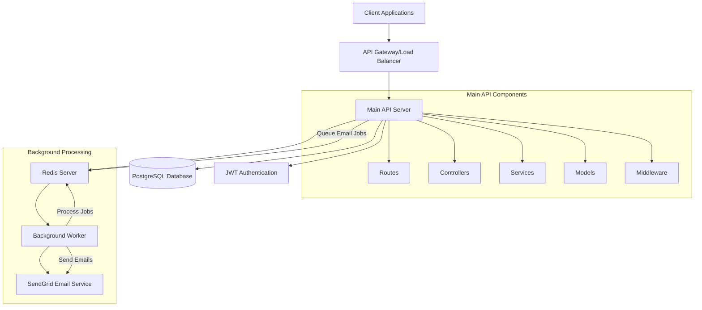
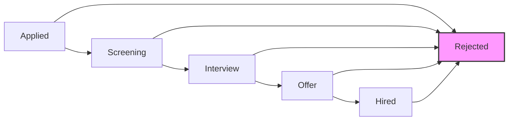

# Job Application Tracking System (ATS) API

A robust backend system for managing job applications with complex workflows, role-based access control, and asynchronous email notifications.

## Features

- **State Machine Workflow**: Enforces valid application stage transitions (Applied → Screening → Interview → Offer → Hired)
- **Role-Based Access Control**: Candidates, Recruiters, and Hiring Managers with appropriate permissions
- **Asynchronous Email Notifications**: Non-blocking email system using BullMQ and SendGrid
- **Audit Trail**: Complete history of application stage changes
- **RESTful API**: Well-structured endpoints for all system operations

## Technology Stack

- **Backend**: Node.js with Express.js
- **Database**: PostgreSQL with Sequelize ORM
- **Authentication**: JWT (JSON Web Tokens)
- **Background Jobs**: BullMQ with Redis
- **Email Service**: SendGrid
- **Testing**: Jest, Supertest

## System Architecture

The Job ATS API follows a layered architecture with clear separation of concerns:

### Main API Components
- **Models**: Sequelize models for data persistence (User, Job, Application, etc.)
- **Controllers**: Handle HTTP requests and responses
- **Routes**: Define API endpoints and apply middleware
- **Middleware**: Authentication, authorization, and request validation
- **Services**: Business logic including state transitions and email notifications

### Background Processing Architecture
The system uses BullMQ with Redis for asynchronous task processing:
1. Main API queues email notification jobs when specific events occur
2. Background worker continuously polls Redis for new jobs
3. Worker processes jobs independently, sending emails via SendGrid
4. This decoupling ensures API responsiveness regardless of email delivery speed

This architecture provides:
- Improved user experience through non-blocking operations
- Better fault tolerance (email failures don't affect API)
- Scalability (multiple workers can be added)

### Architecture Diagram


## Project Structure

```
src/
├── config/          # Database configuration
├── controllers/     # Request handlers
├── jobs/            # Background job processing
├── middleware/      # Authentication and authorization
├── models/          # Database models
├── routes/          # API route definitions
├── services/        # Business logic
└── demo/            # Demonstration scripts
```

## Core Models

1. **User**: Candidates, Recruiters, and Hiring Managers
2. **Company**: Organizations that post jobs
3. **Job**: Job postings with status (open/closed)
4. **Application**: Candidate applications with state machine
5. **ApplicationHistory**: Audit trail of stage changes

## Database Schema (ERD)

```
User (id, email, password, role, companyId)
     1 │                     │
       │                     │
     ╭─┴─────────────────────╯
     ↓
Company (id, name, description)
     1 │
       │
     ╭─╯
     ↓
  Job (id, title, description, status, companyId)
     1 │
       │
     ╭─╯
     ↓
Application (id, stage, jobId, candidateId)
     1 │
       │
     ╭─╯
     ↓
ApplicationHistory (id, previousStage, newStage, applicationId, changedById, createdAt)
```

## Workflow States

The application follows a predefined workflow with the following valid transitions:

### Workflow Diagram


```
Applied → Screening → Interview → Offer → Hired
   │         │          │         │        │
   └─────────┴──────────┴─────────┴────────┘→ Rejected (from any stage)
```

## API Endpoints

### Authentication
- `POST /api/auth/register` - User registration
- `POST /api/auth/login` - User login

### Health Check
- `GET /api/health` - System health status

### Jobs
- `GET /api/jobs` - Get all jobs
- `GET /api/jobs/:id` - Get a specific job
- `POST /api/jobs` - Create a new job (Recruiters only)
- `PUT /api/jobs/:id` - Update a job (Recruiters only)
- `DELETE /api/jobs/:id` - Delete a job (Recruiters only)

### Applications
- `POST /api/applications` - Submit a new application (Candidates only)
- `GET /api/applications/:id` - Get application details
- `PUT /api/applications/:id/stage` - Update application stage (Recruiters only)
- `GET /api/applications` - Get applications with filtering

## Role-Based Access Control

| Role | Permissions |
|------|-------------|
| **Candidate** | Apply for jobs, view own applications |
| **Recruiter** | Manage jobs for their company, view/manage all applications |
| **Hiring Manager** | View applications for assigned jobs |

## Setup Instructions

### Prerequisites
- Node.js 12+
- PostgreSQL database server
- Redis server
- SendGrid account

### Installation Steps
1. Clone the repository:
   ```bash
   git clone https://github.com/yourusername/job-ats-api.git
   cd job-ats-api
   ```

2. Install dependencies:
   ```bash
   npm install
   ```

3. Set up PostgreSQL database:
   - Install PostgreSQL if not already installed
   - Create a new database for the application
   - Note the database name, username, and password

4. Set up Redis server:
   - Install Redis if not already installed
   - Ensure Redis is running on the default port (6379) or update the connection URL

5. Configure SendGrid:
   - Create a SendGrid account if you don't have one
   - Generate an API key with full access to the mail send endpoint

6. Create and configure environment variables:
   - Copy the `.env.example` file to `.env`:
     ```bash
     cp .env.example .env
     ```
   - Update the `.env` file with your actual configuration values:
     ```env
     # Database Configuration
     DB_NAME=your_actual_database_name
     DB_USER=your_actual_database_user
     DB_PASSWORD=your_actual_database_password
     DB_HOST=localhost
     DB_PORT=5432

     # JWT Configuration
     JWT_SECRET=your_strong_jwt_secret_key

     # Redis Configuration for BullMQ
     REDIS_URL=redis://localhost:6379

     # SendGrid API Key for Email Notifications
     SENDGRID_API_KEY=your_actual_sendgrid_api_key

     # Server Configuration
     PORT=3000
     ```

7. Run database migrations:
   ```bash
   npm run dev
   ```
   This will automatically sync the database schema based on your models.

### Starting the Application

1. Start the main API server:
   ```bash
   npm start
   ```
   Or for development with auto-reload:
   ```bash
   npm run dev
   ```

2. Start the background worker (in a separate terminal):
   ```bash
   npm run worker
   ```

Both the main API server and the background worker must be running for the application to function properly.

### Docker Deployment (Recommended)

For easier deployment and testing, you can use Docker:

1. Build and start all services:
   ```bash
   docker-compose up --build
   ```

2. The services will be available at:
   - API: http://localhost:3000
   - PostgreSQL: localhost:5432
   - Redis: localhost:6379

3. To stop all services:
   ```bash
   docker-compose down
   ```

## Environment Variables

Create a `.env` file with the following variables:

```env
# Database Configuration
DB_NAME=your_database_name
DB_USER=your_database_user
DB_PASSWORD=your_database_password
DB_HOST=localhost
DB_PORT=5432

# JWT Configuration
JWT_SECRET=your_jwt_secret

# Redis Configuration for BullMQ
REDIS_URL=redis://localhost:6379

# SendGrid API Key for Email Notifications
SENDGRID_API_KEY=your_sendgrid_api_key

# Server Configuration
PORT=3000
```

## Running the Application

- Start the server: `npm start` or `npm run dev`
- Start the worker: `npm run worker`
- Run unit tests: `npm test`
- Run integration tests: `npm run test:integration`
- Validate requirements: `npm run validate`

## Testing

### Running Unit Tests
```bash
npm test
```

### Running Integration Tests
```bash
npm run test:integration
```

### State Machine Demo
Run the state machine validation demo:
```bash
node src/demo/workflowDemo.js
```

### Requirements Validation
Run the comprehensive requirements validation script:
```bash
npm run validate
```

### Manual API Testing
Use the included Postman collection (`Job-ATS-API.postman_collection.json`) for easy API endpoint testing. Import this file into Postman to get a complete set of pre-configured requests for all API endpoints.

## License

This project is licensed under the MIT License.